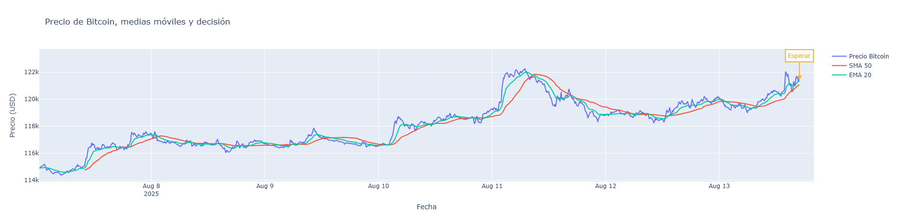

# Bot Trader de Bitcoin

Este proyecto implementa un bot de análisis y toma de decisiones para trading algorítmico de Bitcoin (BTC) utilizando Python. El objetivo es monitorear el precio de BTC en tiempo real, analizar tendencias y sugerir acciones de compra, venta o espera, todo de manera automatizada y visual.

## Características principales

- Obtención automática de datos históricos de BTC/USD desde Yahoo Finance con `yfinance`.
- Extracción del precio y tendencia actual de BTC mediante Web Scraping a CoinMarketCap con `BeautifulSoup`.
- Limpieza y filtrado de datos para eliminar valores atípicos y registros irrelevantes.
- Cálculo de la media robusta del precio de BTC para la toma de decisiones.
- Lógica de trading simple basada en la comparación entre el precio actual, la media y la tendencia.
- Visualización interactiva del precio y la decisión tomada usando `plotly`.
- Automatización del proceso para análisis y visualización en tiempo real.



## Estructura del repositorio

- `Bot_Trader.ipynb`: Notebook principal con todo el flujo de análisis, visualización y automatización.
- `requirements.txt`: Lista de dependencias necesarias para ejecutar el proyecto.
- `img/`: Carpeta para imágenes y gráficos generados.

## Instalación

1. Clona este repositorio:
   ```bash
   git clone https://github.com/zelys/robot-trading.git
   cd robot-trading
   ```
2. (Opcional) Crea y activa un entorno virtual:
   ```bash
   python3 -m venv .venv
   source .venv/bin/activate
   ```
3. Instala las dependencias:
   ```bash
   pip install -r requirements.txt
   ```

## Uso

1. Abre el archivo `Bot_Trader.ipynb` en JupyterLab o VS Code.
2. Ejecuta las celdas del notebook para analizar y visualizar el comportamiento del mercado de Bitcoin.
3. Puedes activar la automatización para monitoreo continuo y toma de decisiones en tiempo real.

## Requisitos

- Python 3.8+
- Conexión a internet

## Créditos

Desarrollado por Zelys.

## Licencia

Este proyecto se distribuye bajo la licencia MIT.
